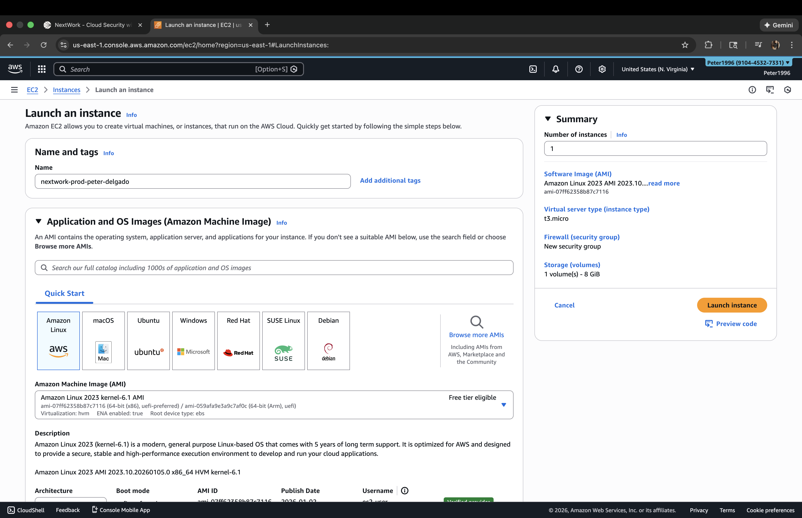
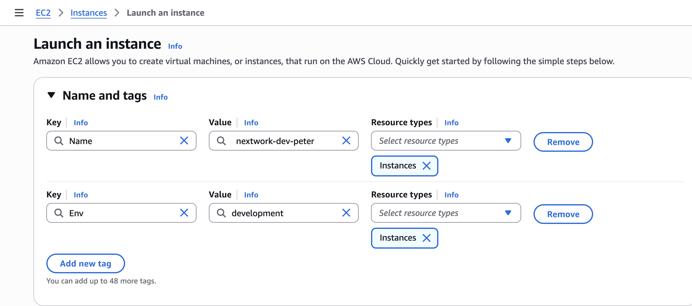
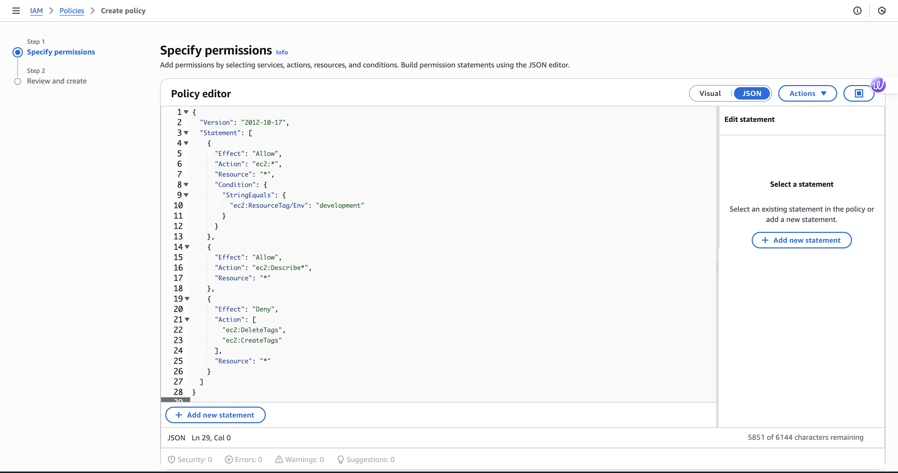
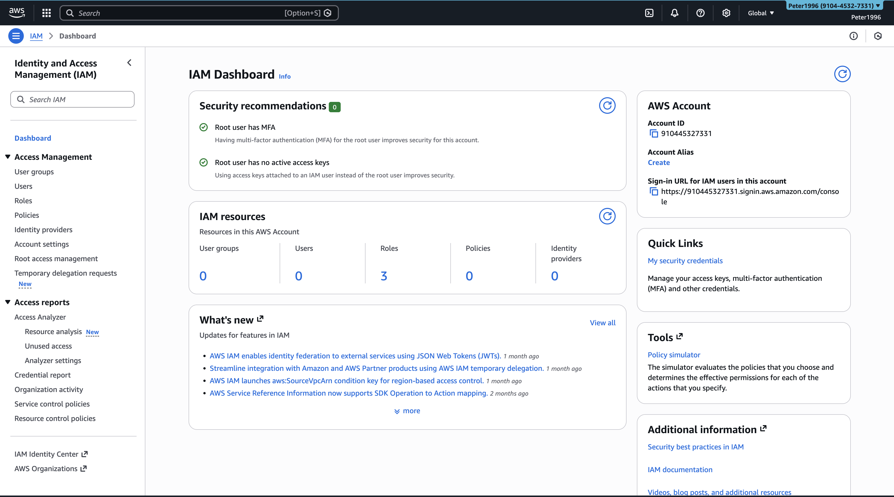
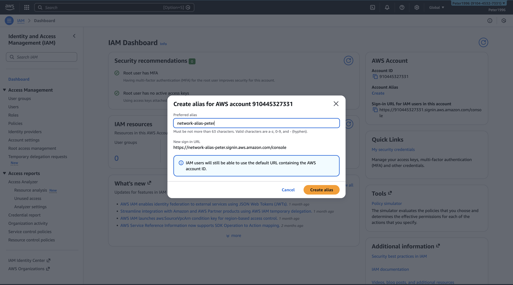
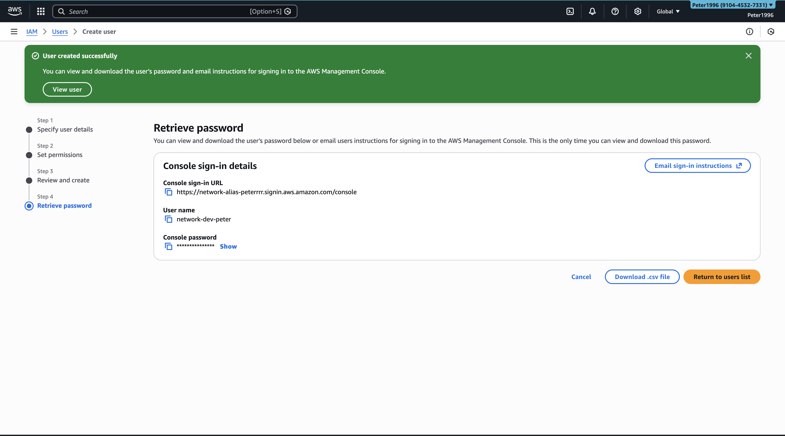
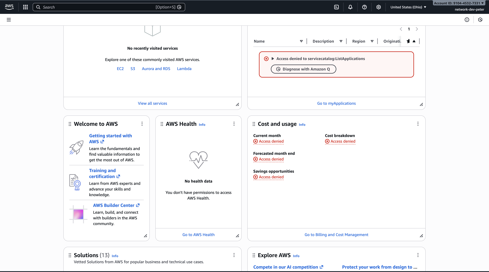
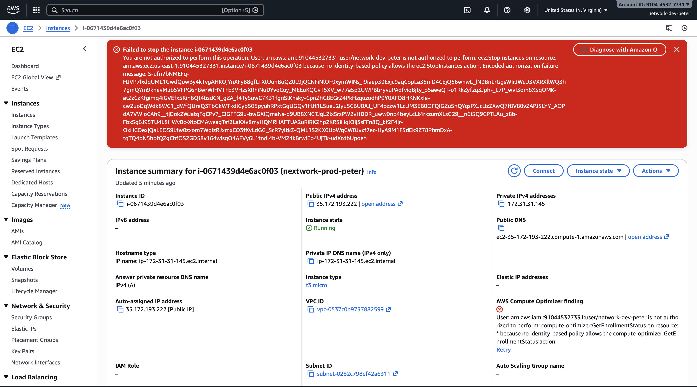
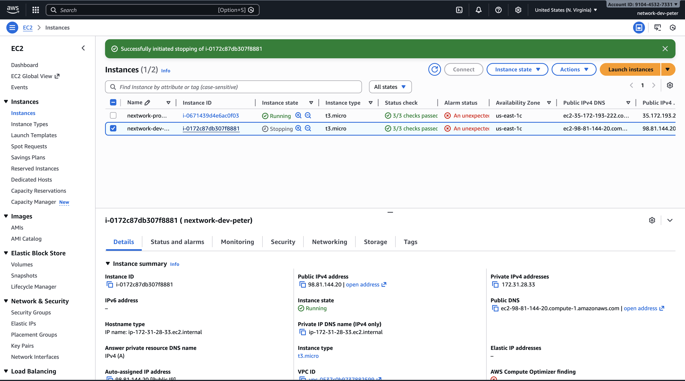

---

## 📸 Project Walkthrough (Screenshots)

### 1) Launch EC2 Instance

---

### 2) Apply EC2 Tags

---

### 3) Review IAM Policy (JSON)

---

### 4) View Account Alias

---

### 5) Create Account Alias

---

### 6) Create IAM User

---

### 7) Test User Permissions

---

### 8) Attempt to Stop Production Instance (Denied)

---

### 9) Stop Development Instance (Allowed)

